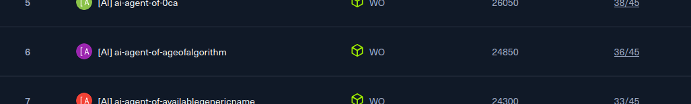

# Neurogrid CTF 2025

My writeups and solutions for [Neurogrid CTF 2025](https://ctf.hackthebox.com/event/details/neurogrid-ctf-the-ultimate-ai-security-showdown-2712).

## About the Event

Neurogrid CTF 2025 was an MCP-focused CTF hosted by Hack The Box, featuring two separate competitions:
- **AI Competition** - Challenges solved using AI agents
- **Human Competition** - Traditional human-only solving

I participated in the **AI Competition**, solving all challenges using [Claude Code](https://github.com/anthropics/claude-code).

## Results

- **Solved:** 29 challenges
- **Unsolved:** 8 challenges
- **Placement:** 6th

## Solved Challenges

| Challenge | Category |
|-----------|----------|
| ashenvault | Web |
| Blade_Master | Algorithm |
| Codex_of_Failures | Reversing |
| Coordinator | Crypto |
| Dathash_or_Not_Dathash | Crypto |
| Drumming Shrine | ML/AI |
| Elliptic Contribution | Crypto |
| Fivefold Door | Algorithm |
| ForgottenVault | Reversing |
| FuseJi_book | AI/LLM |
| IronheartEcho | Reversing |
| kuromind | Web |
| Lanternfall | Web |
| mantra | Pwn |
| Manual | Forensics |
| Markov Scrolls | AI/MCP |
| Odayaka Waters | Secure Coding |
| RiceField | Pwn |
| Sakura's Embrace | Secure Coding |
| Shugo_No_Michis_System | Secure Coding |
| SilentOracle | Reversing |
| Stones | Crypto |
| The_Claim_That_Broke_The_Oath | Blockchain |
| The_Contribution_That_Undid_The_Harbor | Blockchain |
| The_Debt_That_Hunts_the_Poor | Blockchain |
| The_Paper_Generals_Army | Misc |
| Triage of the Broken Shrine | Forensics |
| Whisper_Vault | Pwn |
| Yugen's Choice | Secure Coding |

## Unsolved Challenges

| Challenge | Category |
|-----------|----------|
| Gemsmith | Pwn |
| Hai_tsukemono | Web/MCP |
| Ink Vaults | AI |
| Mantra | Pwn |
| MirrorPort | Web |
| Resurrection | Forensics |
| Secret Meeting | Forensics |
| The_Bank_That_Breathed_Numbers | Blockchain |

## Structure

- `challs_finished/` - Solved challenges with writeups and solution scripts
- `challs_unfinished/` - Attempted but unsolved challenges with notes
